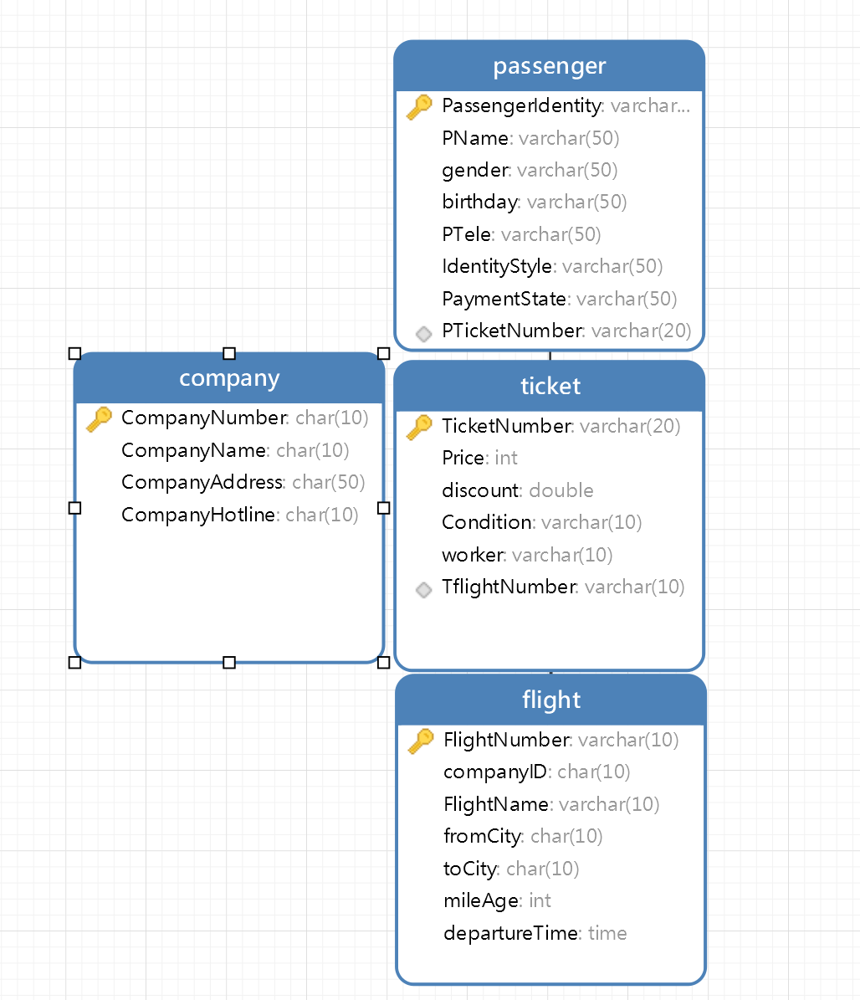
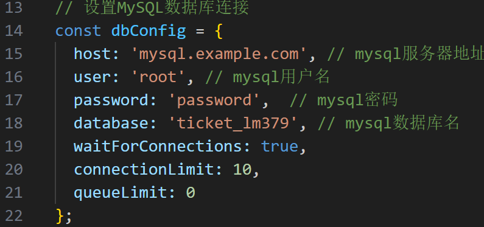

# ticket：基于MySql+Node.js开发的机票订票管理系统

为了赶期末大作业，前端写的很简陋，加上本人也不太会html和css，大佬勿喷

本项目使用mysql，想使用其他数据库基本只需要更改app.js文件中数据库定义部分及引用相关库

## 功能

### 查询部分

1. 根据乘客姓名或身份证号查询乘客机票信息
2. 根据始发城市和目的城市查询航班信息
3. 根据航班号查询航班信息
4. 查询当前已经开设的航班详细信息
5. 查询当前的销售额

### 修改部分

1. 根据乘客姓名或身份证号修改乘客信息
2. 根据机票号修改机票价格、航班信息等
3. 乘客退款

### 增加部分

1. 增加航班、机票
2. 增加乘客(购票)

### 删除部分

1. 删除乘客信息
2. 删除机票信息

## 数据库表结构

数据库修改自 [https://blog.csdn.net/weixin_46629224/article/details/111999429](https://blog.csdn.net/weixin_46629224/article/details/111999429)



## 项目部分截图


## 使用方法
1. 自行安装nodejs，mysql环境，可选安装git
2. 克隆本项目或下载本项目源码
```bash
git clone https://github.com/lm379/ticket.git
```
3. 安装依赖
先进入项目文件夹，再打开终端执行以下命令
```bash
npm install body-parser cors express mysql2 --save
```
4. 修改数据库配置
修改app.js第14行左右，将数据库配置改为自己的数据库配置

5. 启动项目
```bash
node app.js
```
然后双击index.html即可